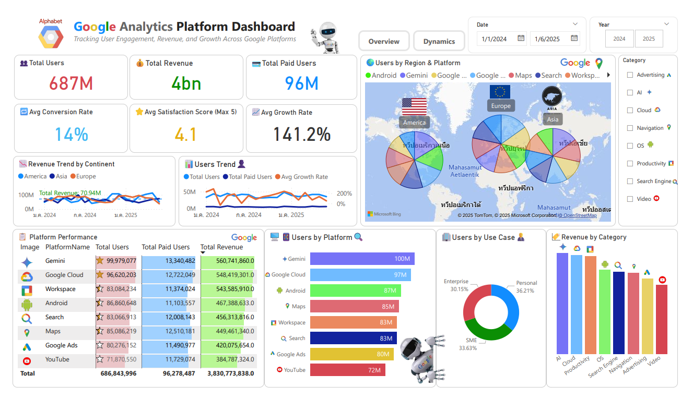
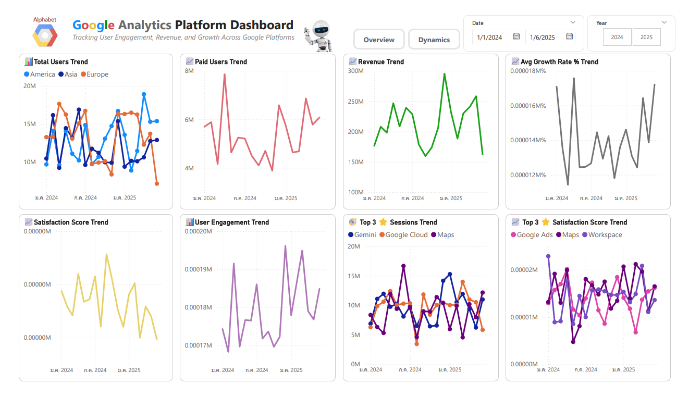

# 📊 Google Analytics Platform Dashboard  
Power BI Dashboard | Mock Data | Google Platforms Visualization

This project showcases a **Power BI dashboard** simulating user behavior, revenue, and satisfaction across major Google platforms (e.g., Analytics, Cloud, Workspace) using mock datasets. The project demonstrates how to transform raw CSV data into meaningful, interactive visualizations that help drive business insights.

> ⚠️ **Note**: All datasets are simulated for educational purposes only.

---

## 🧠 What this project demonstrates

- Analyze total users, paid users, and revenue per platform
- Visualize user engagement, growth rate, and satisfaction score
- Understand regional usage distribution across platforms
- Explore KPI dynamics over time

---

## 📁 Files Included

| File | Description |
|------|-------------|
| `Google_Analytics_Platform_Dashboard.pbix` | Power BI Dashboard File |
| `DimPlatform.csv` | Dimension: Platform details |
| `DimRegion.csv` | Dimension: Geographic regions |
| `FactUsage.csv` | Fact table: User metrics and revenue |
| `overview.png` | Image of main dashboard overview |
| `dynamics.png` | Image showing KPI dynamics over time |

---

## 🛠 Tools & Technologies

- **Power BI**: Dashboard design & analytics
- **CSV**: Structured data inputs (mock)
- **Data Modeling**: Star schema
- **Data Viz**: KPI cards, bar charts, line graphs, slicers

---
